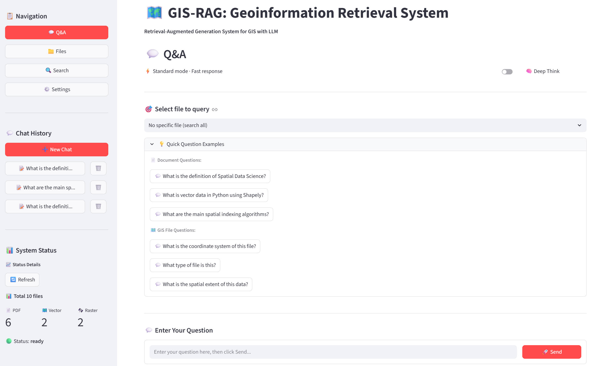

# GIS-RAG: Geoinformation-Retrieval-System 🛰️

Unlock the full potential of your geospatial data with **GIS-RAG**.

This local-first Retrieval-Augmented Generation (RAG) system enables you to interact with your data using natural language. Whether it's technical PDF manuals, vector shapefiles, or satellite imagery metadata, GIS-RAG extracts the critical information and allows you to "chat" with it—all powered by a secure, local Large Language Model (LLM).



## Features

- 💬**Chat with your GIS Data**: seamless Integration of Local LLMs with geospatial datasets.
- 🌍**Multimodal Support** 📦:
    - **Vector Data**: Intelligently extracts attributes and metadata from Shapefiles (.shp), GeoJSON, and KML.
    - **Raster Data**: Understands resolution, bounds, and bands from GeoTIFFs and satellite imagery.
    - **Documents**: Parses PDFs (slides, research papers) to provide context-aware answers.
- 🔒**Privacy First**: Fully local execution (embedding & generation) ensures your sensitive data never leaves your machine.
- 🖥️**Dual Interface**: User-friendly Web UI (Streamlit) for easy interaction and a robust API (FastAPI) for developers.

## Requirements

- Python 3.10+
- For local GPU deployment, 8GB+ VRAM is recommended

## Recommended Models

- LLM (Instruct): [`Qwen/Qwen3-4B-Instruct-2507-FP8`](https://huggingface.co/Qwen/Qwen3-4B-Instruct-2507-FP8)
- LLM (Thinking): [`Qwen/Qwen3-4B-Thinking-2507-FP8`](https://huggingface.co/Qwen/Qwen3-4B-Thinking-2507-FP8)
- Embedding model: [`BAAI/bge-m3`](https://huggingface.co/BAAI/bge-m3) (a strong multilingual retrieval model)

These are a practical choice on an RTX 4070 (8GB VRAM) for local inference.

## Quick Start

### 1) Install dependencies

```bash
pip install -r requirements.txt
```

It is recommended to run inside a virtual environment (venv/conda both work).

### 2) Configure `.env` (recommended)

This project reads configuration from `.env` in the repository root. Use the provided example file:

```bash
# Windows (PowerShell)
Copy-Item .env.example .env

# macOS/Linux
cp .env.example .env
```

Then edit `.env` and set at least the Instruct model path and device:

```ini
# Base model (Instruct)
LLM_INSTRUCT_MODEL_PATH=YOUR_LOCAL_MODEL_DIR
LLM_INSTRUCT_MODEL_NAME=Qwen/Qwen3-4B-Instruct-2507-FP8

# Optional: thinking model (Deep Think)
LLM_THINKING_MODEL_PATH=YOUR_LOCAL_THINKING_MODEL_DIR
LLM_THINKING_MODEL_NAME=Qwen/Qwen3-4B-Thinking-2507-FP8

# Device: cuda or cpu
DEVICE=cuda

# Service ports (optional)
API_HOST=127.0.0.1
API_PORT=8000
WEB_HOST=127.0.0.1
WEB_PORT=8501
```

Embedding settings, retrieval strategy, chunking parameters, etc. can also be overridden via `.env` (see `.env.example` for a full list).

### 3) Start the Web UI

```bash
python start_web.py
```

Default URL: `http://localhost:8501`

### 4) Start the API

```bash
python start_api.py
```

Default URL: `http://localhost:8000`  
Swagger docs: `http://localhost:8000/docs`

## Data & Directories

By default, the project uses `data/` as its working data directory:

```
data/
  pdfs/          # PDF documents
  vector/        # Vector data (.shp/.geojson/.gpkg/.kml)
  raster/        # Raster data (.tif/.tiff/.jp2/.img/.nc)
  chroma_db/     # Vector store persistence (Chroma)
  conversations/ # Web chat history
  uploads/       # Raw uploaded file cache (Web)
logs/            # Runtime logs
```

You can either place files directly into these folders, or upload them via the Web UI.

## Supported Formats

- Vector: Shapefile (.shp), GeoJSON (.geojson), GeoPackage (.gpkg), KML (.kml)
- Raster: GeoTIFF (.tif/.tiff), JPEG2000 (.jp2), IMG (.img), NetCDF (.nc)
- Documents: PDF (.pdf)

## Acknowledgements

Thanks to the Qwen team and the BAAI team for open-sourcing excellent models.


